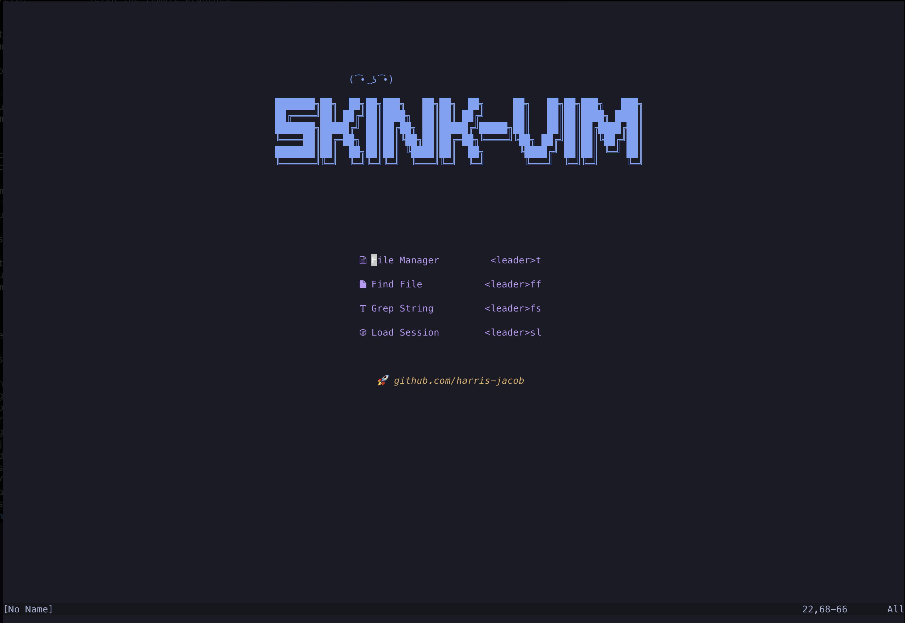

#skink-vim

My attempt at creating a nice nvim workflow for myself. This started out as a fork of [cosmic](https://github.com/CosmicNvim/CosmicNvim)
but has now become an evergrowing amalgamation of other stuff I have seen. See Below:

- [cosmic](https://github.com/CosmicNvim/CosmicNvim)
- [spacevim](https://github.com/SpaceVim/SpaceVim)
- [ecosse3/nvim](https://github.com/ecosse3/nvim)

## Setup
Some notes to setup on a blank machine. Most things should work out of the box. Required installs are:

- node
- typescript/typescript-langauage-server
- eslint_d
- prettier_d
- markdownlint

